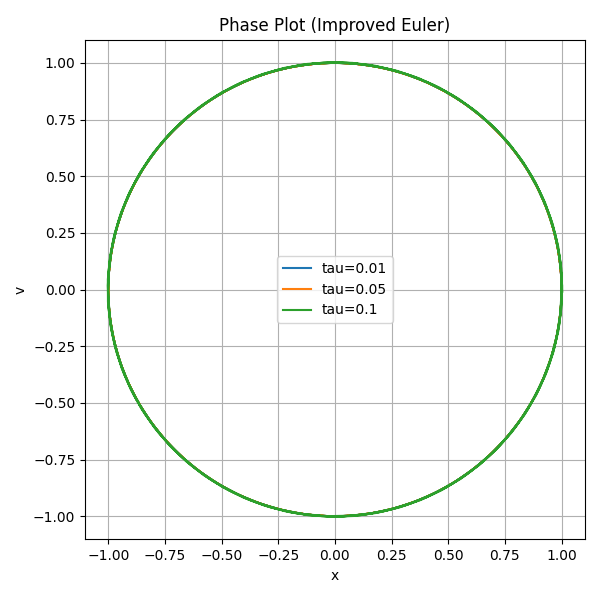
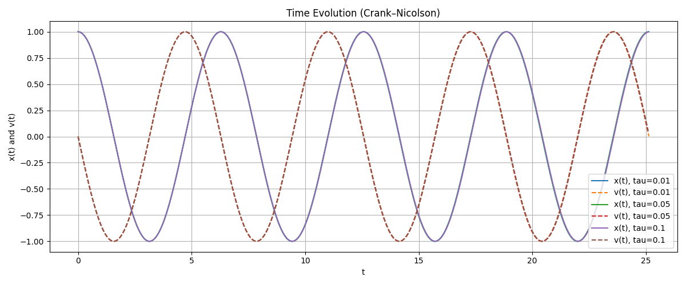

# Team 09 : Exercise 1 (Due 24.11.2025)
*All documents we mentioned can be found in branch "Exercise1".*

```
For Mass-Spring System, set m=k. 

Use different time-steps tau = {0.1, 0.05, 0.01} and much larger end-times T=8*pi.
```

## Exercise 17.2.2

### Q1 : Overall Process
1. Adapted the `Explicit_Euler.cpp` to get `explicit_euler.csv`. 
2. Adapted the `plotq1.py` to get performance plot `plot1_time_evolution.png` and `plot2_phase.png`.
3. Attention: Add .cpp path into `CMakeLists.txt` such that we can compile directly.

### Q1 : Plot 

#### Plot 1 : Time Evolution (explicit euler)


#### Plot 2 : Phase Plots (explicit euler)


### Q1 : Conclusion
- In time evolution plots, both x(t) and v(t) show increasing amplitude, and the growth becomes faster for larger time steps.
- In phase plots clearly illustrate this behavior: instead of forming closed circles (energy conservation), the trajectories spiral outward.
- Overall, explicit Euler is numerically unstable for this oscillatory system, and bigger step sizes make worse.

-----
### Q2 : Overall Process
Similar with Q1, adapted `Improved_Euler.cpp` to get `improved_euler.csv`. Then adapted `plotq2.py` and get graph `plot3` and `plot4`.


### Q2 : Plot 

#### Plot 3 : Time Evolution (improved euler)


#### Plot 4 : Phase Plots (improved euler)



### Comparison: Explicit Euler Method vs Improved Euler Method
- Obviously, the Improved Euler method shows significantly better stability and accuracy for the mass–spring system.

- For all three time steps, the time-evolution plots indicate that Improved Euler preserves both the amplitude and phase of the oscillation almost perfectly over long times. In contrast, Explicit Euler exhibits clear fluctuation.

- The phase plots further highlight this difference: Improved Euler produces closed circular trajectories that remain nearly identical for all tau, indicating near-conservation of energy. Explicit Euler, however, generates outward-spiraling curves whose radius increases with time, especially for larger tau.


## Exercise 17.4.1

### Q1 : Overall Process
Adapted `Implicit_Euler.cpp` to get `implicit_euler.csv`. Then adaped `plotq2.1.py` and get graph `plot5` and `plot6`.

### Q1 : Plot 

#### Plot 5 : Time Evolution (implicit euler)


#### Plot 6 : Phase Plots (implicit euler)


### Q2 : Overall Process
1. The general function of Crank-Nicolson method is:

$$
u_{n+1} - u_n - \frac{\tau}{2}\bigl(f(u_{n+1}) + f(u_n)\bigr) = 0 .
$$

2. Adapted `Crank_Nicolson.cpp` to get `crank_nicolson.csv`. Then adaped `plotq2.2.py` and get graph `plot7` and `plot8`.

### Q2 : Plot 

#### Plot 5 : Time Evolution (Crank-Nicolson)


#### Plot 6 : Phase Plots (Crank-Nicolson)


### Q3 : Comparison of the Four Time-Stepping Methods

Now we compare 4 methods in previouly mentioned:

**Explicit Euler**

- The method is unstable for oscillatory systems.

- For moderate or even small time-steps, the numerical orbit in the phase plane spirals outward, corresponding to an artificial gain of energy.

- Larger time-steps lead to very rapid divergence.

**Improved Euler**

- Shows second-order accuracy and significantly better behavior.

- The phase curves stay close to a circle, even for larger time-steps.

- There is still a small drift, but the energy error remains bounded and does not grow dramatically like in Explicit Euler.

**Implicit Euler**

- Always stable, regardless of time-step size.

- However, the solution exhibits numerical damping: the phase orbit spirals inward, meaning the method artificially removes energy from the system.


**Crank–Nicolson**

-  Champion. Always stable, and energy-preserving method for linear oscillatory systems.

- The phase plots remain almost perfectly circular for all tested time-steps.

```
In General: 
For oscillatory systems -- the mass–spring model, Crank–Nicolson provides the most physically accurate long-time behavior, while Explicit Euler is the worst method.
```
