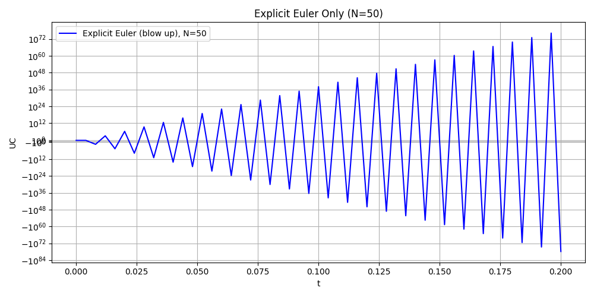
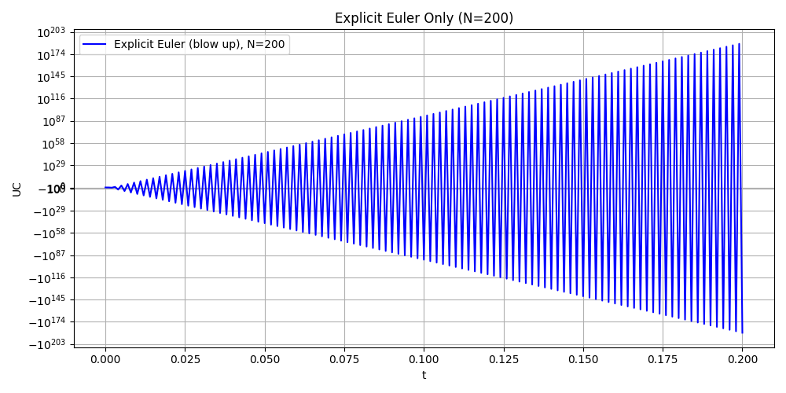
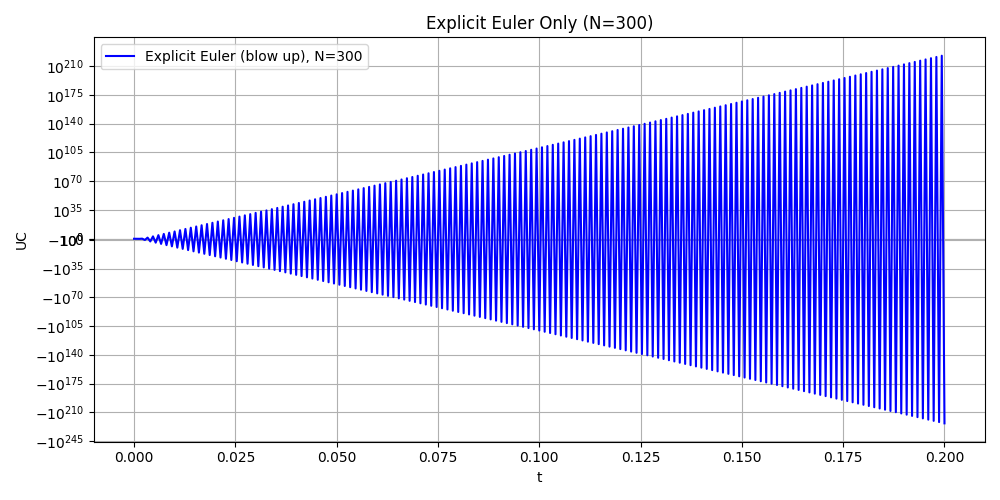
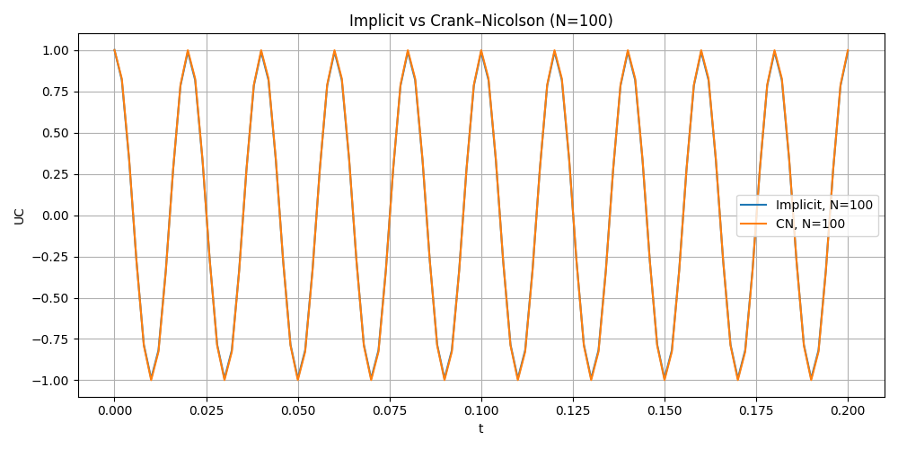
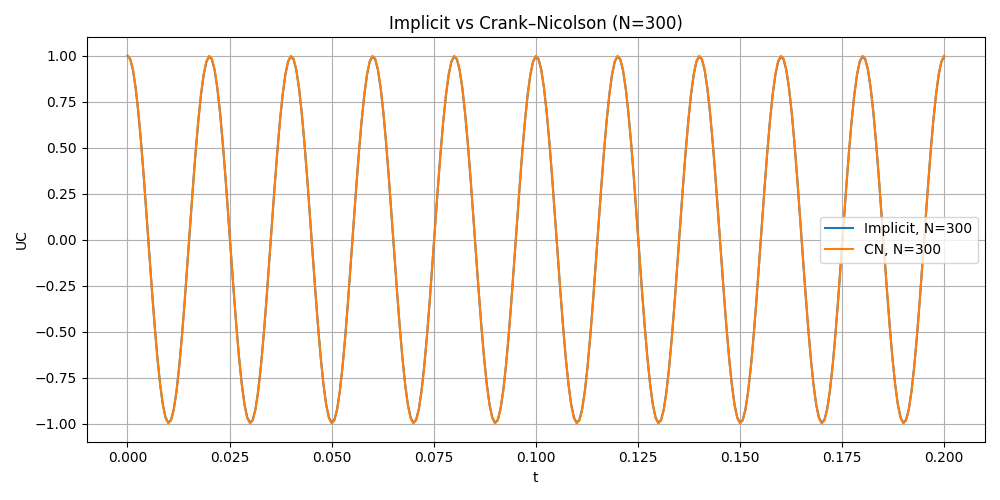
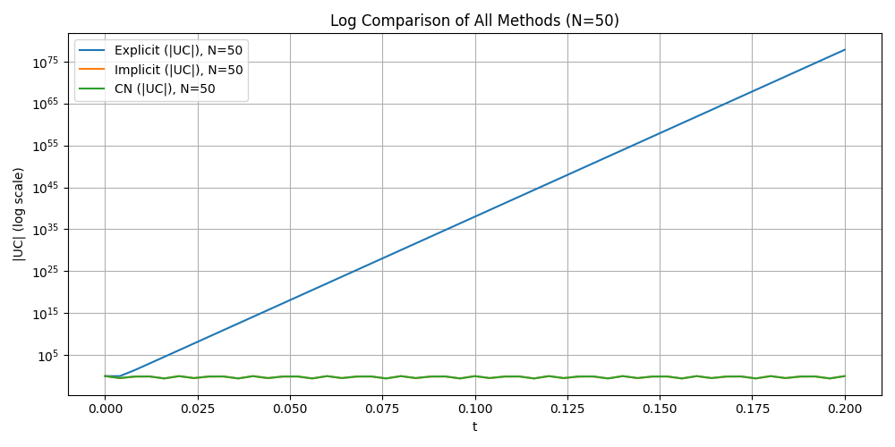
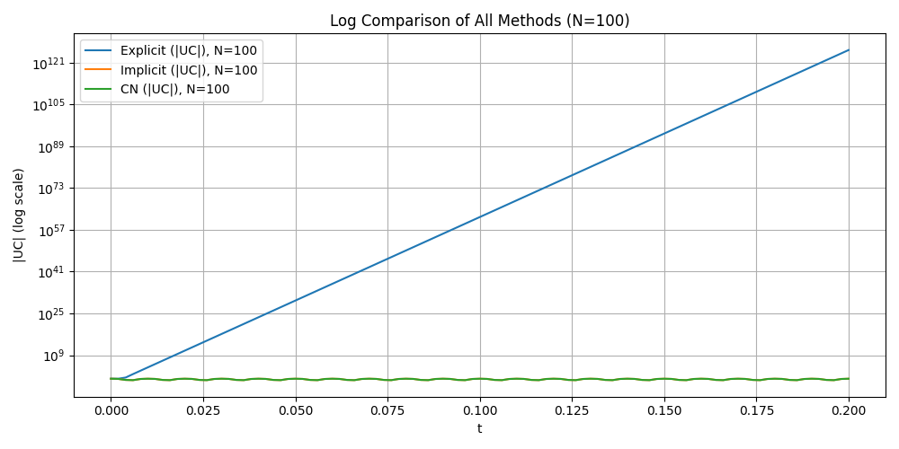
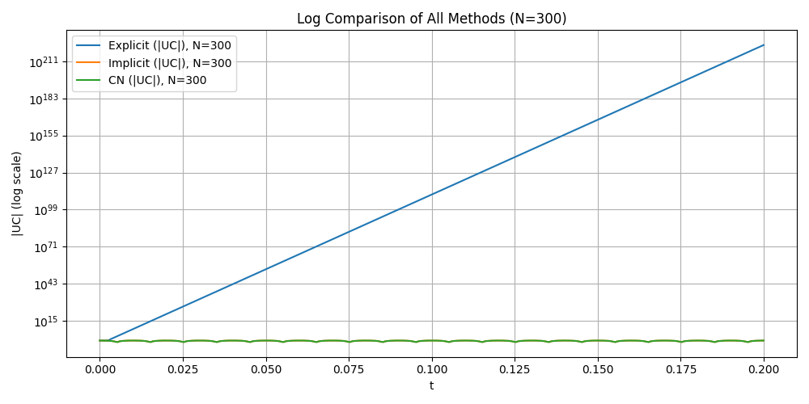
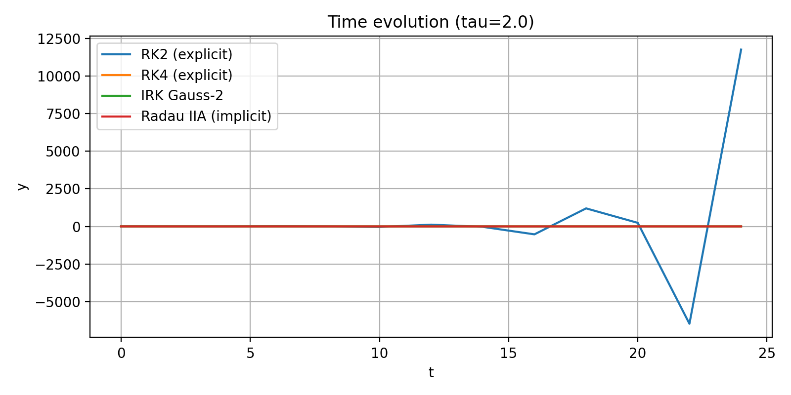

# Exercise 2 (Due 01.12.2025)
*All documents we mentioned can be found in branch "Exercise2".*


## Exercise 17.4.1

### Q4: Question Review

We already have the main funtion

$$
U_c(t) + RC\,\frac{dU_C}{dt} = U_0(t)
$$

with initial condition: $U_c(0) = U_0(0)$

and assumption:

1. $U_c(t)$ is the unknown quantity
2. $U_0(t) = cos(100*pi*t)$
3. R = 100
4. C = $ 10 ^{-6}$

### Q4.1 : Rewrite the system to antonomous form

We see that in the function, there are some terms realted to *t*. Now we define a new vector:

$$
x_1 = U_c(t), x_2 = t
$$

then the new vecotr:

$$
x = \begin{pmatrix}
x_1 \\
x_2
\end{pmatrix}
$$

**Finally we get the autonomous ODE:**

$$
\dot{x}_1 = \frac{1}{RC}\left(\cos(100\pi x_2) - x_1\right)
$$

$$
\dot{x}_2 = 1
$$

with initial value

$$
x_1(0) = U_0(0) = 1, \qquad x_2(0) = 0
$$


### Q4.2 : Numerically solve the problem with 3 methods

In order to compare the methods: Explicit Euler, Implicit Euler and Crank Nilcolson method, add three head files: `RCRHC.hpp` `RCCircuit.hpp` and `RHS.hpp`

Modify the previous main document, change the model from mass-spring to RC circuit. The main files are `xian.cpp` `yin.cpp` and `cn.cpp`. After getting the `csv` files, plot and analyze.

**Attention**: Here we choose fixed step N = {50, 100, 200,300} and T = 0.2 to compare. In this case, the explicit method is not stable and the numerical solution blows up. So we put explicit euler method seperately and add log-log plot to see the error.

### Plot

**Explicit Euler method in different time step** (BLOW UP)









**Implicit Euler vs Crank Nicolson in different time step**







**Error Analysis**









### Conclusion

- Explicit Euler is unstable for the RC circuit.
The step sizes 
Δ𝑡=𝑇/𝑁 violate the stability limit Δ𝑡<2𝑅𝐶, leading to rapid blow-up.

- Implicit Euler is stable but overly damped.
As an A-stable first-order method, it does not diverge, but it introduces strong numerical dissipation.

- Crank–Nicolson gives the best results.
It is A-stable, second-order accurate, and preserves oscillation amplitude without artificial damping.

- **Convergence behavior:**
Explicit Euler → 1st order (unstable here)
Implicit Euler → 1st order (stable but dissipative)
Crank–Nicolson → 2nd order (accurate and stable)

**Overall:**
For this stiff RC system, Crank–Nicolson is the best method.


## Exercise 18.4

### Q1 & Q2: Implementation of AutoDiff Class. Overall Process.
1. Extended the provided `autodiff.hpp` library to include additional useful operators. Specifically, subtraction (`operator-`), negative sign operator and division (`operator/`) by applying the quotient rule.
2. Added some more mathematical functions like `cos`, `exp` and `log` that accept `AutoDiff` variables and computed correctly its derivatives by implementing the chain rule.
3. Verified the correctness of these new operators using `demo_autodiff_new.cpp`.

-----

### Q3: Legendre- Polynomials. Overall process.

1. Implemented the recursive formula to compute Legendre-polynomials. Since our `AutoDiff` class supports templates, the same function calculates both values and derivatives:
   ```cpp
   P[k] = ((T(2 * k - 1) * x * P[k - 1]) - T(k - 1) * P[k - 2]) / T(k);
2. Created `test_legendre.cpp` to generate data (with step 0.02) for Legendre-polynomials up to order $n=5$ in the interval $[-1, 1]$.
3. Created the python script `plot_combined.py` to visualize the family of polynomials and their derivatives.

### Q3: Plots

#### Plot 1: Legendre-Polynomials (Orders 0 to 5)


#### Plot 2: Legendre-Polynomials Derivatives (Orders 1 to 5)
Note: Derivative of the Polynomial or order 0 is not shown because its value is 0, so plotting it would make the graphic much smaller to show that horizontal line at 0 making it difficult to see the other polynomials derivative values.


### Q3: Conclusion
- As seen in Plot 1, all polynomials strictly satisfy the theoretical condition $P_n(1) = 1$, confirming the numerical stability of the recursive implementation.
- Parity and Symmetry: The plots show the parity properties of Legendre-polynomials:
    - Even orders ($P_0, P_2, P_4$) are symmetric about the Y-axis (even functions).
    - Odd orders ($P_1, P_3, P_5$) are antisymmetric (odd functions), satisfying $P_n(-1) = -1$.
- Derivative Behavior: Plot 2 shows that derivatives oscillate with increasing amplitude near the boundaries. For the order 5 polynomial, the derivative at $x=1$ take the value 15 which is the theoretical prediction $P'_n(1) = \frac{n(n+1)}{2}$.
- The derivative inverts the parity: for an even polynomial, $P'_n$ becomes an odd function (crossing zero at the origin) and vice versa.


## Exercise 18.5 — AutoDiff Pendulum

### Overall Process

1. Adapted the C++ file `ex18_5.cpp` to simulate the nonlinear pendulum using  

$$
\dot{\theta} = \omega,\qquad 
\dot{\omega} = -\frac{g}{L}\sin(\theta)
$$

with **AutoDiff-based Jacobian evaluation**.

2. Generated output trajectory file:  
   **`ex18_5.csv`**

3. Created Python scripts to plot:  
   - `pendulum_time.png` — Time evolution of θ(t) and ω(t)  
   - `pendulum_phase.png` — Phase portrait (θ vs ω)

---

### Plots

#### **Plot 1 – Time Evolution of Pendulum (Explicit Euler)**


This plot shows the temporal evolution of the pendulum state variables:
- $\( \theta(t) \)$ : angular displacement  
- $\( \omega(t) \)$: angular velocity  

Euler integration introduces numerical energy growth over time.

---

#### **Plot 2 – Phase Plot (Explicit Euler)**


This is the θ–ω phase portrait of the nonlinear pendulum.  
A true physical pendulum would trace closed orbits (constant energy), but explicit Euler causes energy to drift.

---

### Conclusion

- The explicit Euler method behaves **numerically unstable** for oscillatory systems like the pendulum.
- The **time evolution plot** shows that both  $\( \theta(t) \)$ and $\( \omega(t) \)$ exhibit **increasing amplitude**, indicating energy gain.
- The **phase portrait** spirals outward instead of forming closed loops:
  - This means **energy is not conserved** numerically.
  - The trajectory grows unphysically over time.
- AutoDiff successfully computes Jacobians for the nonlinear pendulum model.


## Exercise 19.4 — Comparison of RK2, RK4, Gauss–Legendre (s=2), and Radau IIA (s=2)

### Overall Process

1. **Implementation of a generic ExplicitRungeKutta time-stepper**  
   - Created `ExplicitRungeKutta` class in `explicitRK.hpp` that takes an arbitrary **Butcher tableau**  
     \((A,b,c)\) with **strictly lower triangular** \(A\) (explicit RK).  

2. **Definition of specific Butcher tableaus**
   - Added setup routines for  
     - **RK2 (Heun)**  
     - **RK4 (classical 4th-order)**  
     - **Gauss–Legendre IRK (s=2)**  
     - **Radau IIA IRK (s=2)**.

3. **Comparison driver**
   - Implemented `Rk_compare.cpp` using the ASC-ODE framework and the above time-steppers.  
   - For each method and each τ, we solve the mass–spring system on \([0,8\pi]\) and write CSV files  
     `ex19_4_rk2.csv`, `ex19_4_rk4.csv`, `ex19_4_irk_gauss2.csv`, `ex19_4_radau2a.csv`.

4. **Postprocessing / plotting**
   - `plot_RK_methods.py`: time evolution and phase plots for each τ.  
   - `plot_RK_errors.py`: error vs time, using the exact solution \(y(t)=\cos t\), \(v(t)=-\sin t\).

---

## Plots

Below we summarize the key graphical outputs (only representative examples are shown; full set available in the repository).

---

## Plot 1 — Time Evolution (τ = 0.01)

All four methods overlap almost perfectly.  
Small step size ⇒ high accuracy for all methods; the oscillation keeps correct amplitude and phase.

   
---

## Plot 2 — Time Evolution (τ = 0.5)

Differences become visible:

- **RK2** starts to lose phase accuracy and amplitude.  
- **RK4** performs better, but a small phase drift appears.  
- **Gauss–Legendre** and **Radau IIA** remain stable and stay close to the true oscillation.


---

## Plot 3 — Time Evolution (τ = 2.0)

- **RK2** becomes completely unstable and diverges.  
- **RK4** already shows strong distortion.  
- **Radau IIA** heavily damps the oscillation (L-stable behavior).  
- **Gauss–Legendre** remains bounded but with reduced accuracy due to the very large τ.
 


---

## Plot 4 — Phase Portraits (τ = 0.01)

All methods produce nearly perfect circular phase trajectories.  
This corresponds to almost energy-conserving behavior at small τ.

---

## Plot 5 — Phase Portraits (τ = 0.5)

- **RK2** spirals outward ⇒ artificial energy gain.  
- **RK4**, **Gauss–2**, and **Radau IIA** stay close to the exact circle; trajectories remain bounded.

---

## Plot 6 — Phase Portraits (τ = 2.0)

- **RK2** spirals dramatically outward (complete loss of stability).  
- **RK4** still oscillatory but clearly distorted.  
- **Gauss–Legendre** stays bounded.  
- **Radau IIA** spirals inward due to numerical damping (L-stability).

---

## Plot 7 — Error vs Time

For each τ, the error is computed as  
\[
\text{err}(t) = \big\|\,(y_{\text{num}}(t),v_{\text{num}}(t)) - (\cos t,-\sin t)\,\big\|.
\]

### τ = 0.01 and τ = 0.1

- **RK2**: small but steadily growing error.  
- **RK4**, **Gauss–2**, **Radau IIA**: extremely small errors; curves almost coincide.
 

### τ = 0.5

- **RK2**: error of order **O(1)** over the time interval.  
- **RK4**: mild growth, still acceptable.  
- **Gauss–2** and **Radau IIA**: error stays very small and almost bounded.

### τ = 1.0 and τ = 2.0

- **RK2**: error grows catastrophically (instability).  
- **RK4**: significant drift but still bounded.  
- **Gauss–Legendre**: stable with moderate error.  
- **Radau IIA**: best stability; error remains small even for τ = 2.0.
 

---

## Conclusions

### ExplicitRungeKutta implementation

- The generic `ExplicitRungeKutta` time-stepper successfully handles arbitrary explicit Butcher tableaus with a lower triangular \(A\).  
- RK2 and RK4 are obtained only by providing their coefficients, confirming that the implementation is method-agnostic and reusable.

### RK2 (Explicit Heun)

- Second-order accuracy; works well only for small τ.  
- For τ ≥ 0.5, strong phase and amplitude errors accumulate.  
- For τ ≥ 1.0, RK2 becomes numerically unstable for the oscillatory system.

### RK4 (Classical Explicit)

- Much better long-time accuracy than RK2.  
- Still not A-stable: for very large τ, phase errors become dominant.  
- Reasonable choice for moderate τ when an explicit scheme is required.

### Gauss–Legendre IRK (s=2)

- A-stable and symplectic.  
- Preserves the qualitative structure of the oscillation very well, even for larger τ.  
- Error remains bounded for all tested step sizes; phase plots stay close to a circle.

### Radau IIA IRK (s=2)

- L-stable implicit method: damps high-frequency / stiff components.  
- Extremely robust for large τ; the solution does not blow up.  
- Shows numerical damping on this pure oscillatory problem, but has the best stability among all tested methods.


