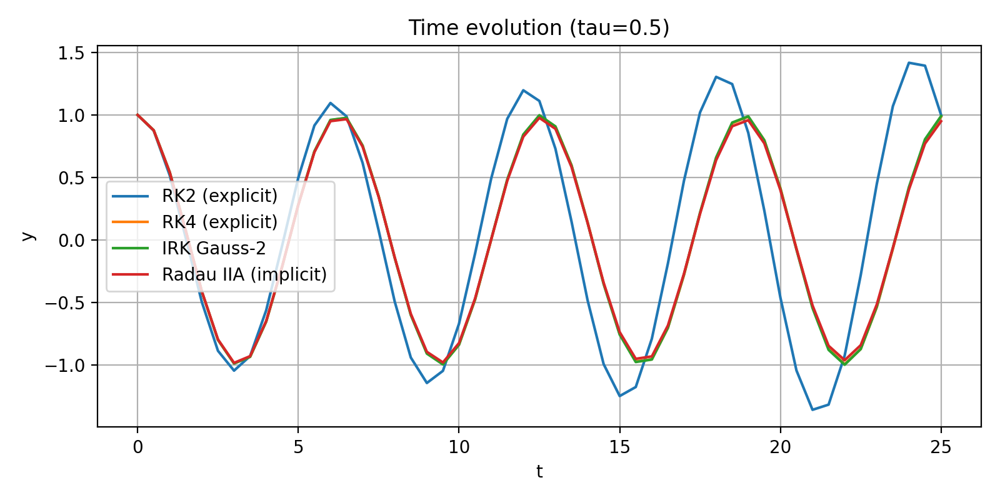
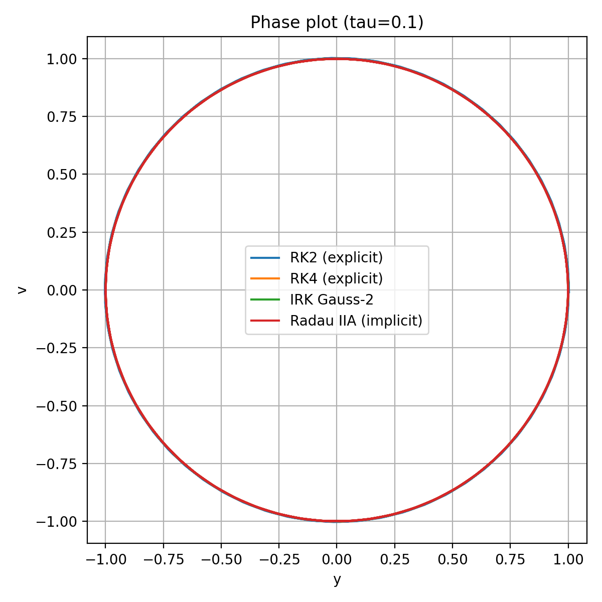
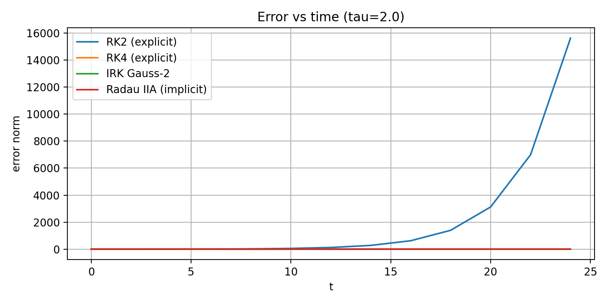

## Exercise 19.4 — Comparison of RK2, RK4, Gauss–Legendre (s=2), and Radau IIA (s=2)

### Overall Process

1. **Implementation of a generic ExplicitRungeKutta time-stepper**  
   - Created `ExplicitRungeKutta` class in `explicitRK.hpp` that takes an arbitrary **Butcher tableau**  
     \((A,b,c)\) with **strictly lower triangular** \(A\) (explicit RK).  

2. **Definition of specific Butcher tableaus**
   - Added setup routines for  
     - **RK2 (Heun)**  
     - **RK4 (classical 4th-order)**  
     - **Gauss–Legendre IRK (s=2)**  
     - **Radau IIA IRK (s=2)**.

3. **Comparison driver**
   - Implemented `Rk_compare.cpp` using the ASC-ODE framework and the above time-steppers.  
   - For each method and each τ, we solve the mass–spring system on \([0,8\pi]\) and write CSV files  
     `ex19_4_rk2.csv`, `ex19_4_rk4.csv`, `ex19_4_irk_gauss2.csv`, `ex19_4_radau2a.csv`.

4. **Postprocessing / plotting**
   - `plot_RK_methods.py`: time evolution and phase plots for each τ.  
   - `plot_RK_errors.py`: error vs time, using the exact solution \(y(t)=\cos t\), \(v(t)=-\sin t\).

---

## Plots

Below we summarize the key graphical outputs (only representative examples are shown; full set available in the repository).

---

## Plot 1 — Time Evolution (τ = 0.01)

All four methods overlap almost perfectly.  
Small step size ⇒ high accuracy for all methods; the oscillation keeps correct amplitude and phase.

   
---

## Plot 2 — Time Evolution (τ = 0.5)

Differences become visible:

- **RK2** starts to lose phase accuracy and amplitude.  
- **RK4** performs better, but a small phase drift appears.  
- **Gauss–Legendre** and **Radau IIA** remain stable and stay close to the true oscillation.

---

## Plot 3 — Time Evolution (τ = 2.0)

- **RK2** becomes completely unstable and diverges.  
- **RK4** already shows strong distortion.  
- **Radau IIA** heavily damps the oscillation (L-stable behavior).  
- **Gauss–Legendre** remains bounded but with reduced accuracy due to the very large τ.
 

---

## Plot 4 — Phase Portraits (τ = 0.01)

All methods produce nearly perfect circular phase trajectories.  
This corresponds to almost energy-conserving behavior at small τ.

---

## Plot 5 — Phase Portraits (τ = 0.5)

- **RK2** spirals outward ⇒ artificial energy gain.  
- **RK4**, **Gauss–2**, and **Radau IIA** stay close to the exact circle; trajectories remain bounded.

---

## Plot 6 — Phase Portraits (τ = 2.0)

- **RK2** spirals dramatically outward (complete loss of stability).  
- **RK4** still oscillatory but clearly distorted.  
- **Gauss–Legendre** stays bounded.  
- **Radau IIA** spirals inward due to numerical damping (L-stability).

---

## Plot 7 — Error vs Time

For each τ, the error is computed as  
\[
\text{err}(t) = \big\|\,(y_{\text{num}}(t),v_{\text{num}}(t)) - (\cos t,-\sin t)\,\big\|.
\]

### τ = 0.01 and τ = 0.1

- **RK2**: small but steadily growing error.  
- **RK4**, **Gauss–2**, **Radau IIA**: extremely small errors; curves almost coincide.
 

### τ = 0.5

- **RK2**: error of order **O(1)** over the time interval.  
- **RK4**: mild growth, still acceptable.  
- **Gauss–2** and **Radau IIA**: error stays very small and almost bounded.

### τ = 1.0 and τ = 2.0

- **RK2**: error grows catastrophically (instability).  
- **RK4**: significant drift but still bounded.  
- **Gauss–Legendre**: stable with moderate error.  
- **Radau IIA**: best stability; error remains small even for τ = 2.0.
 

---

## Conclusions

### ExplicitRungeKutta implementation

- The generic `ExplicitRungeKutta` time-stepper successfully handles arbitrary explicit Butcher tableaus with a lower triangular \(A\).  
- RK2 and RK4 are obtained only by providing their coefficients, confirming that the implementation is method-agnostic and reusable.

### RK2 (Explicit Heun)

- Second-order accuracy; works well only for small τ.  
- For τ ≥ 0.5, strong phase and amplitude errors accumulate.  
- For τ ≥ 1.0, RK2 becomes numerically unstable for the oscillatory system.

### RK4 (Classical Explicit)

- Much better long-time accuracy than RK2.  
- Still not A-stable: for very large τ, phase errors become dominant.  
- Reasonable choice for moderate τ when an explicit scheme is required.

### Gauss–Legendre IRK (s=2)

- A-stable and symplectic.  
- Preserves the qualitative structure of the oscillation very well, even for larger τ.  
- Error remains bounded for all tested step sizes; phase plots stay close to a circle.

### Radau IIA IRK (s=2)

- L-stable implicit method: damps high-frequency / stiff components.  
- Extremely robust for large τ; the solution does not blow up.  
- Shows numerical damping on this pure oscillatory problem, but has the best stability among all tested methods.

